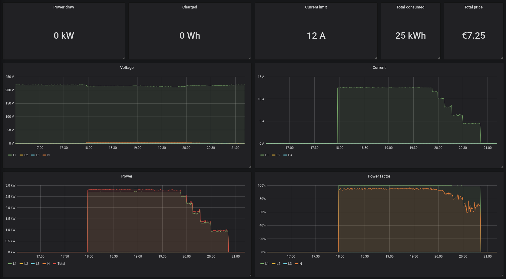

# Monitor your go-eCharger with Telegraf

This is a set of tools for monitoring you Go-eCharger with Telegraf. It uses the MQTT functionality for gathering data, therefore you need an MQTT broker.

Since the JSON data send by the go-eCharger is not properly formatted and can't be read directly from Telegraf, I included a tiny daemon converting the JSON and republishing it to an MQTT topic.

## Installation

Edit `go-echarger-json-fixd` and `telegraf.d/go-echarger.conf` to use your MQTT server. Then install `go-echarger-json-fixd` to `/usr/local/bin/` and install the systemd unit file to `/etc/systemd/system/`. The telegraf config file is installed to `/etc/telegraf/telegraf.d/`.

